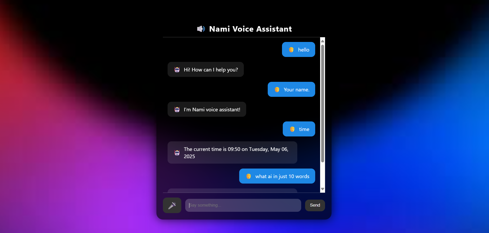

# Voice Assistant Web App

This is a modern voice assistant web application built using **Flask** for the backend and **HTML**, **CSS**, and **JavaScript** for the frontend. The app uses a rule-based approach with a fallback AI system for processing user input and providing responses. The UI features speech recognition and synthesis, providing a Siri-like experience.

## Features

* **Voice Interaction**: The app allows users to speak to the assistant, using Web Speech API for speech-to-text and text-to-speech functionality.
* **Rule-based Responses**: The assistant can respond to simple queries such as "Hello", "How are you?", "What time is it?", and "Bye".
* **AI Fallback**: If the user query doesn't match any predefined rules, the assistant falls back to a free AI API (OpenRouter) for more complex responses.
* **Smooth UI Animations**: The app includes smooth entrance animations, message fading, and hover effects to make the user experience more interactive.

## Technologies Used

* **Backend**: Flask (Python)
* **Frontend**: HTML, CSS, JavaScript
* **Voice Recognition**: Web Speech API (Speech-to-Text & Text-to-Speech)
* **AI API**: OpenRouter for AI-based responses
* **Animations**: CSS animations for smooth transitions

## Requirements

To run this app locally, you need the following:

* Python 3.x
* Flask
* `requests` library for making API calls

### Installation

1. Clone the repository:

   ```bash
   git clone https://github.com/mehtahrishi/voice-assistant-app.git
   cd voice-assistant-app
   ```

2. Create a virtual environment (optional but recommended):

   ```bash
   python3 -m venv venv
   source venv/bin/activate  # On Windows, use `venv\Scripts\activate`
   ```

3. Install the required dependencies:

   ```bash
   pip install -r requirements.txt
   ```

4. **Set up OpenRouter API Key**:
   You will need an API key from OpenRouter to handle AI responses. Create an account at [OpenRouter](https://openrouter.ai/) and get your API key. Add the key in the `app.py` file:

   ```python
   OPENROUTER_API_KEY = "your-api-key-here"
   ```

5. **Run the app**:
   Start the Flask app by running:

   ```bash
   python app.py
   ```

   The app will be hosted at `http://127.0.0.1:5000/` by default.

## How it Works

### Backend (Flask)

* **`app.py`**: The Flask app handles the routes:

  * `/`: Renders the main interface (`index.html`).
  * `/ask`: Handles user input, checks for rule-based responses, and falls back to OpenRouter for AI-based responses.

  Rule-based responses include:

  * "Hello" → "Hi! How can I help you?"
  * "Your name" → "I’m your voice assistant!"
  * "Time" → "The current time is \[time]"
  * "Date" → "Today is \[date]"
  * "How are you?" → "I'm just code, but feeling quite functional!"
  * "Bye" → "Goodbye! Have a great day!"

  If no rule-based match is found, the app queries OpenRouter for a response.

### Frontend (HTML, CSS, JS)

* **`index.html`**: The main structure of the user interface.

  * **Mic Button**: Starts and stops speech recognition when clicked. It toggles between a microphone icon (🎤) and a stop icon (🚩).
  * **Message Box**: Displays the conversation with the assistant. User messages are aligned to the right, and bot messages are aligned to the left.
  * **Text Input**: Allows the user to type messages if preferred over speech input.

* **`styles.css`**: Provides a dark theme with a background image, smooth animations, and stylish UI elements.

  * **Animations**: Smooth transitions for elements when they appear, hover effects for buttons, and scale animations for the mic button.

* **JavaScript**:

  * **Speech Recognition**: The Web Speech API listens for user input and converts speech to text.
  * **Speech Synthesis**: After receiving a response from the server, the assistant will speak the response using the Speech Synthesis API.
  * **Fetch API**: Sends user input to the Flask backend and retrieves the response (either rule-based or AI-generated).

## Usage

1. **Voice Input**:

   * Click the mic button to start listening.
   * Speak into your microphone.
   * The assistant will recognize your speech, convert it to text, and respond accordingly.

2. **Text Input**:

   * Type a message in the input field.
   * Press the **Send** button or hit **Enter** to submit your query.

3. **AI Fallback**:

   * If the assistant doesn't recognize your input, it will call the OpenRouter API to generate a relevant response.

4. **Text-to-Speech**:

   * After processing the input, the assistant will speak the response using speech synthesis.

## Screenshots

 <!-- Add a screenshot of the app here -->

## Contributing

Feel free to fork this repository and create a pull request if you'd like to contribute improvements or bug fixes.

## License

This project is open-source and available under the MIT License.
